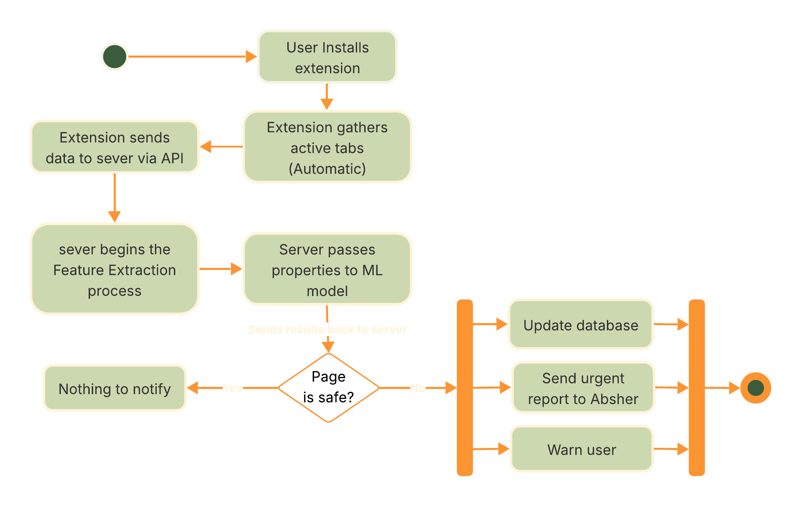

# 🛡️ HATHIR

## Made by

### **✨ CodeGuardians**

- 👩🏽‍💻 Rayanah Alqoblan
- 👩🏽‍💻 Fajr Almugri

Built for the **Absher Tuwaiq Hackathon** 🚀

## 📌 Project Overview

**Hathir** is a Chrome extension and backend system designed to extract, analyze, and manage website data.
It processes both public and secure (HTTPS) websites and outputs structured, multilingual-ready JSON.

The system integrates:

- Real-time data extraction from a Chrome extension
- Back-end analysis & processing through Flask APIs
- Dynamic front-end visualization
- SSL certificate verification
- AI powered advanced analysis

---

## ⚡ Features

- **Website Data Extraction & Analysis**
  - Extract HTML content, URLs, meta tags, and SSL certificates  
  - Analyze page structure and dynamic content  
  - Handle HTTPS and public websites  

- **Chrome Extension**
  - Collects website data in real-time  
  - Integrates seamlessly with the backend  

- **Back-end & APIs**
  - Flask-based web server with RESTful endpoints  
  - Processes data collection, SSL verification, and dynamic updates  
  - Integrates with OpenAI API for advanced analysis  

- **Front-end**
  - Dynamic updates on the interface  
  - Visualization of page content and meta information  

- **Data Handling**
  - Stores structured data in JSON format  
  - Generates organized reports for analysis  

---

## 🛠️ Technical Stack

**Languages & Tools:**

- Python, JavaScript, HTML, CSS  
- VS Code, GitHub, Chrome DevTools  

**Python Libraries:**

- `Flask`, `flask_cors`  
- `requests`, `BeautifulSoup`  
- `ssl`, `socket`  
- `urllib.parse`  

**Chrome APIs:**

- Fetch API  
- OpenAI API integration  

**Data Formats:**

- JSON  
- HTML & meta tags  

**Hosting & Deployment:**

- Flask web server for backend processing  
- Dynamic front-end rendering  
- SSL verification for HTTPS websites  

---

## 🗂️ Workflow

1. **Initialization**
   - Trigger data collection via Chrome extension or API request  

2. **Data Collection**
   - Extract HTML content, URLs, meta tags, and SSL certificate info  
   - Chrome extension provides real-time data updates  

3. **Processing**
   - Convert extracted data into structured JSON  
   - Handle dynamic and interactive content  

4. **Analysis & Reporting**
   - Summarize website components and structure  
   - Generate readable reports for public or secure pages  
 chrome

---

## 📊 Flowchart

